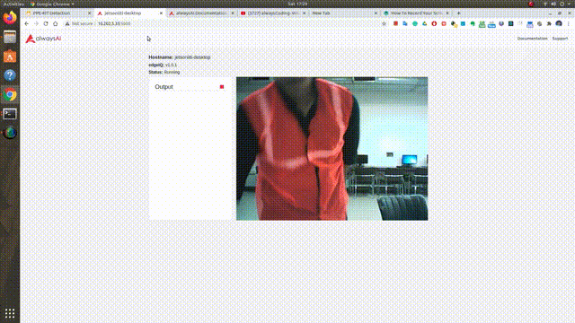
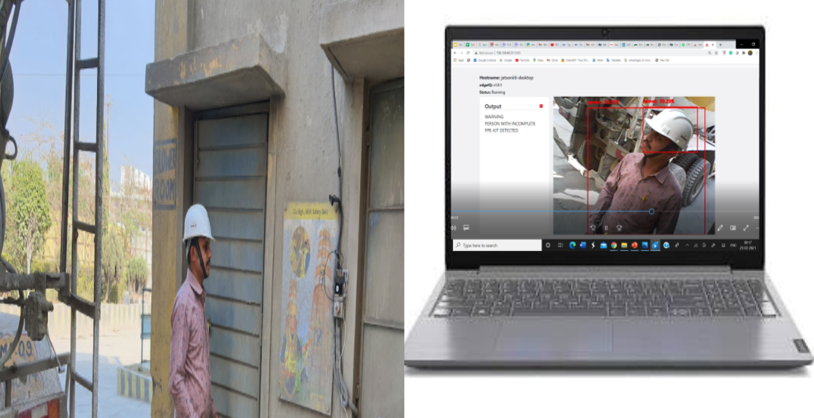
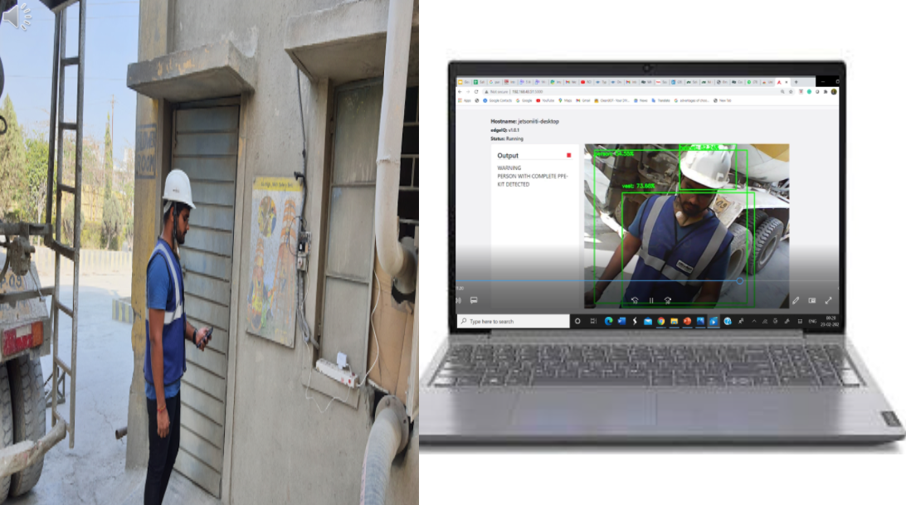

# PPE-KIT Detection

### Domain- Safety Inspection

### Problem- To avoid the entrance of unauthorised people in restricted area or non-compliance of PPE equipments.

## The Application is designed to classify the video frame in three categories based on two PPE items- Helmet and Vest

1. Person without PPE
2. Person with Incomplete PPE( either helmet is missing or vest ) 
3. Person with complete PPE

## Steps-

### Data Collection- Dataset

In our case we are using already available dataset from kaggle.

Labels: 

1. Helmet
2. Vest

[Hardhat and Safety Vest Image for Object Detection](https://www.kaggle.com/johnsyin97/hardhat-and-safety-vest-image-for-object-detection)

### Model Training

Model: mobilenet_ssd

Input Image size: 300x300 

Epochs: 10

We are using a framework called alwaysai model training toolkit to train the model

for more details: 

[Model Training - alwaysAI Documentation documentation](https://alwaysai.co/docs/model_training/index.html)

### Model Serving and Deployment

We are using same framework for deployment.

The model is deployed to an Edge Device by Nvidia- Jetson Nano

 

### Lab Testing

### Plant Testing

